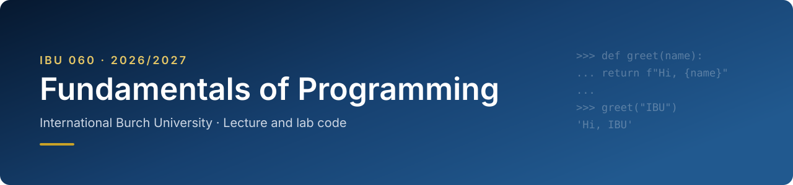

<p align="center">
  
</p>

<p align="center">
  
  
  
</p>

Code from lectures and labs for **IBU 060 Fundamentals of Programming** at International Burch University. I push the code after every class, so if you missed a lecture you can catch up here.

Announcements, quizzes and assignment submissions are all on **Moodle**. This repo only has the code.

## Getting started

To get the code, clone the repo:

```bash
git clone https://github.com/MirzaKrupic/ibu060-2026.git
```

Then run `git pull` each week to get the new material. If you don't use git yet, **Code → Download ZIP** works too.

## Schedule

| Week | Topic | Reading |
|-----:|-------|---------|
| 1 | [Introduction](weeks/01-introduction/) | Ch. 1 |
| 2 | [Variables and Data Types](weeks/02-variables-and-data-types/) | Ch. 2 |
| 3 | [Conditionals and Iterations](weeks/03-conditionals-and-iterations/) | Ch. 3–4 |
| 4 | [Functions](weeks/04-functions/) | Ch. 5 |
| 5 | [Strings](weeks/05-strings/) | Ch. 8 |
| 6 | [Lambda](weeks/06-lambda/) | — |
| 7 | [Modules](weeks/07-modules/) | Ch. 5 |
| 8 | [Recursion](weeks/08-recursion/) | Ch. 12 |
| 9 | [Lists](weeks/09-lists/) | Ch. 7 |
| 10 | [Dictionaries](weeks/10-dictionaries/) | Ch. 9 |
| 11 | [Sets and Tuples](weeks/11-sets-and-tuples/) | Ch. 7, 9 |
| 12 | [Files (Binary and Text)](weeks/12-files/) | Ch. 6 |
| 13 | [Exceptions](weeks/13-exceptions/) | Ch. 6 |
| 14 | [Python outside of the IDE – NumPy](weeks/14-numpy/) | — |
| 15 | [Wrap up](weeks/15-wrap-up/) | — |

Readings refer to Tony Gaddis, *Starting Out with Python*, 5th edition.

## Class times

| | When | Where |
|---|---|---|
| Lectures, Group A | Tue 09:00–12:00 | R004, Building A |
| Lectures, Group B | Mon 09:00–12:00 | R004, Building A |
| Labs | Mon and Tue 13:00–15:00 | |

Check which group you're in on Moodle.

## Teaching team

| Name | Role | Consultations |
|------|------|---------------|
| Mirza Krupić | Lecturer, TA | [Book a slot](https://calendar.app.google/i4SiKW5zZPS7RSfW6) |
| Emina Osmić | TA | [Book a slot](https://calendar.app.google/McYmSwk4PejZhrc76) |
| Nedim Bandžović | TA | — |
| Samira Zeba | LA | — |

## Grading

| Component | Weight |
|-----------|-------:|
| Quizzes | 25% |
| Assignments | 25% |
| Final exam | 50% |

The full rules on grading, attendance and conduct are in the [course policy](https://docs.google.com/document/d/1F9xtRbWLFWYXPdsHA9cbCNt_ay8P35wxcUVWOc5G6AQ/edit?usp=sharing). There's also the [syllabus (PDF)](resources/syllabus.pdf).

## What's in this repo

```
weeks/
  01-introduction/
    lecture/     code written in class
    lab/         starter files for the lab
  02-.../
resources/       syllabus and cheat sheets
```

Found a mistake in the code? Open an [issue](https://github.com/MirzaKrupic/ibu060-2026/issues) or tell me after class.
